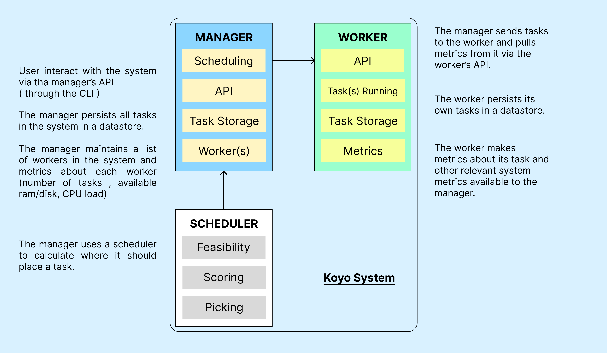

# Koyo : Lightweight Orchestration System written in Go

## 🔦 About

Koyo is a single manager based fully functional orchestration system written entirely in Go (< 3000 lines). It takes request from a user to run an application, identifies a machine that can run the application, and then send a request to the chosen machine to start the application.

While the orchestrator is fully functional, **it is not production ready.**

## 🔎 Architecture

## 📦 Tools and Libraries used

- [Chi Router](https://github.com/go-chi/chi)
- [Docker SDK](https://docs.docker.com/engine/api/sdk/)
- [BoltDB](https://github.com/boltdb/bolt)
- goprocinfo

## 🏁 Setup 
TODO

I followed the book "Build an Orchestrator in Go (From Scratch)" by Tim Boring as reference for the project 
:)
Great book , must read if you want a deeper dive into Orchestration Systems internals.
